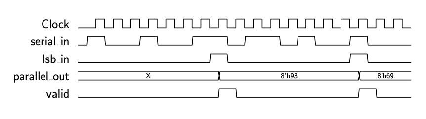

# Extra credit for ECE3300 Fall 2024

Edit the file src/Ser2Par.v to implement a serial to parallel converter.

The module will accept serial data on the "serial_in" port, and will shift this data into a
parallel register with "WORD_SIZE" bits.  The shifting will be done into the lsb, moving all
of the other bits to the left (i.e. toward the MSB).

The "lsb_in" input signal is also an input and will be set high when the final bit of the current
word is on the serial_in port.
The completed word should then be saved into the register "parallel_out", and the "valid"
signal should go high for one clock cycle, indicating a complete new word is available.

Here is the timing diagram:

Don't change any of the names in the module ports definition - only add the Verilog code in the module.  This
allows the testbench to run and test your code.

If your code passes the testbench tests, you should see a green check mark on Github at the top
of the repository display.

Your code also will be checked to make sure it doesn't create any inferred latches.

